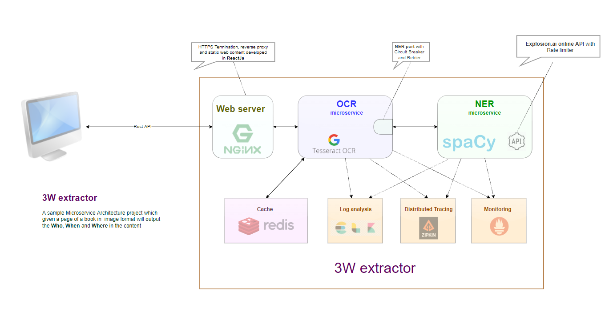
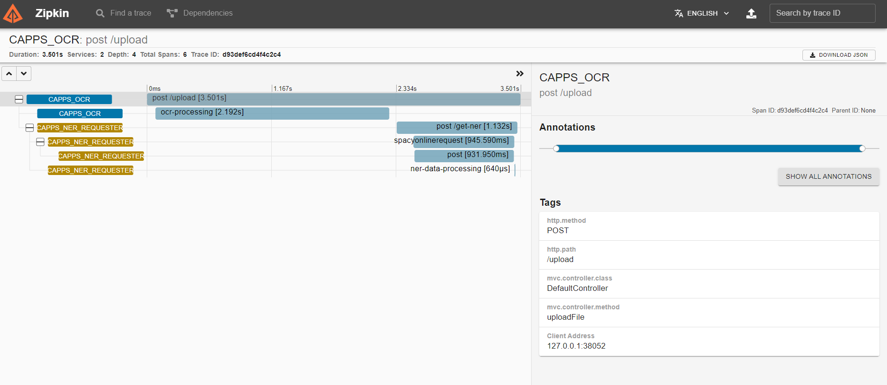

# 3W extractor
A sample Microservice Architecture project which given a page of a book in  image format will output all the Who, When and Where in the content



## Components
* **Nginx  Webserver**  
Hosts the Static web content, also provides HTTPS termination and reverse proxy
*  **OCR microservice**  
Uses Tess4j Java wrapper for Teseract OCR to extract text from images and sends the content for NER extraction
* **NER microservice**  
Uses Spacy model exposed online by Explosion.ai site to extract the NER entities
* **Redis - Cache**
Caches input image data to quickly respond to duplicates image requests
* **Zipkin / Sleuth - Distributed Tracing**
Tracks path taken by the incoming request throgh out the all the microservices
* **Prometheus / Micrometer - Monitoring**
Sends the stats of the JVM to the Prometheus adapter and visualizes it with Grafana
* **Log analysis - ELK**  
Uses Logstash to export the log data to Elastic search for analysis
* **Disaster recovery - Resilience4j** 
Uses Resilience4j Java library to introduce Fault tolerance features like Circuit Breaker and  Rate Limiter


## Distributed Tracing Zipkin screenshot



## Deployment
```
cd prometeus-server
docker-compose up -d
curl -v -X POST -H "Content-Type: multipart/form-data"  -F "file=@/home/dev/temp/inv1.jpg" http://localhost:8080/upload
```

